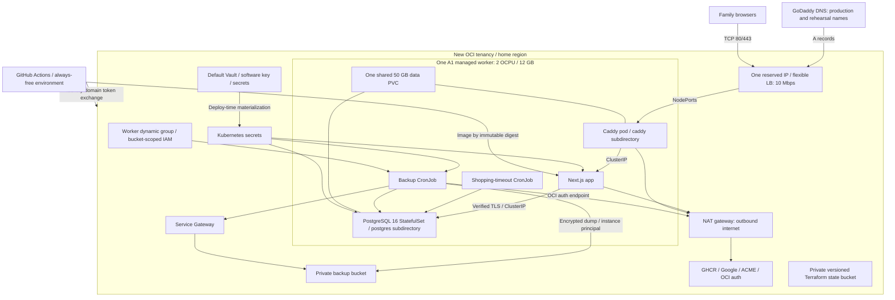

# OCI Always Free design and migration plan

**Record status, October 8, 2026:** provisioning, rehearsal, production cutover and a canonical shopping run have passed. Daily backup jobs and GitHub backup alerts are enabled. Old retirement and default-branch handoff remain pending the rollback-hold checkpoint. This document preserves the original design/migration decisions; dated proposals below are historical. Use the [current architecture/tools](oci-deployment-plan.md) and [operator runbook](oci-always-free-operations.md) for live operations.

**Original planning status (October 5):** federation had passed and implementation was underway; the later live status is recorded above and in [execution checkpoints](oci-always-free-checkpoints.md).

**Prepared:** October 4, 2026; revised October 5 for shared storage, five daily backups, GitHub/Lens access, and latest supported Kubernetes.

**Baseline:** `master` at `813968f` (external GoDaddy DNS), including the shopping-timeout CronJob.

**Proposed implementation branch:** `codex/oci-always-free`.

**October 6 access decision:** The operator explicitly requested leaving API TCP 6443 open to IPv4 sources during the build and while traveling. Retain TLS, OCI IAM authentication and Kubernetes RBAC. Source allowlisting and temporary runner rules below are deferred follow-up options, not provisioning gates. Workers, pods, PostgreSQL and kubelet remain private.

**Accepted storage decisions:** share one PVC between Caddy and PostgreSQL, leaving capacity for future pods; create one database backup daily and retain the last five successful daily backups.

**Verified target:** OCI CLI profile `EDFREETIER`; tenancy `edfreetier`, OCID `ocid1.tenancy.oc1..aaaaaaaaxr2zj2tokqai2vyetuiinhzdr2i6yupriqasl5im3jwv7yjfa2ua`; home/target region `us-ashburn-1`; existing ACTIVE compartment `grocery`, OCID `ocid1.compartment.oc1..aaaaaaaayhvqxmlrywosn7ef2jtruuvatnovwluou2bhwzbtstg5sq2gtppa`. Verified through read-only OCI APIs on October 5 after the profile update. Use this profile explicitly; do not substitute the default or another profile. See [target preflight results](oci-always-free-preflight.md) for quotas, image/version options, and remaining checks.

## 1. Outcome and boundaries

Create an independent deployment in a new OCI tenancy: Basic OKE, exactly one managed A1 worker with 2 OCPUs / 12 GB RAM, PostgreSQL 16 inside Kubernetes, one Always Free flexible load balancer, and externally hosted GoDaddy DNS. Keep the current environment serving production from `master` while the branch provisions and tests the replacement. Rehearse restore and run a real shopping trip on the replacement, cut over with a final consistent backup, then retain the old environment as a rollback target through a second real shopping trip. Destroy the old environment using its original Terraform before merging the branch. After merge, normal instructions and workflows target only the replacement.

This is a migration of hosting and database operations. Preserve application behavior, PostgreSQL schema, Prisma migrations, household IDs, memberships, permissions, history, and Google authentication. Do not combine it with a schema redesign or second-app rollout. The shared Caddy design and storage reserve permit a second app later, after measuring resources.

Both environments coexist, but they do not simultaneously accept authoritative family writes. Rehearsal data is disposable. After final cutover, the new database is authoritative; the old app remains in maintenance. There is no bidirectional database replication.

Execution was authorized after review. The migration branch and its isolated GitHub environment have been created. At that initial authorization checkpoint, no OCI application infrastructure, database, or DNS changes had yet been made. Manual identity setup is checkpoint 1; provisioning follows successful federation verification and the reviewed infrastructure implementation.

## 2. Eligibility and zero-cost acceptance gate

A free-priced Basic control plane and a tenancy permitted to create OKE are distinct. Oracle's Node-on-OKE tutorial lists a paid account prerequisite. Before provisioning, inspect the new tenancy's account mode, OKE limits, home region, and actual entitlements. If OKE requires PAYG enablement, obtain approval for that account change; the infrastructure will still stay within the conservative free resource envelope. Do not assume an unupgraded, expired Free Trial can run OKE. If account enablement is unacceptable, this specific managed-OKE design is blocked; changing to self-hosted Kubernetes would require a separate design decision. [Oracle OKE tutorial prerequisites](https://docs.oracle.com/en-us/iaas/Content/developer/node-on-k8s/01oci-node-k8s-summary.htm)

Oracle currently documents A1 allowances of 1,500 OCPU-hours and 9,000 GB-hours/month, 200 GB combined boot/block storage, five volume backups, and one 10 Mbps flexible LB. Standard Object Storage allowances vary with account mode; use a conservative 10 GB Standard envelope. Default Vaults, software-protected keys, and a bounded number of secrets fit the free offering. Compute/storage must qualify in the home region. Idle compute can be reclaimed. Confirm all allowances and other tenancy usage in the Console. [Always Free resources](https://docs.oracle.com/en-us/iaas/Content/FreeTier/freetier_topic-Always_Free_Resources.htm?Highlight=jobs+with+tools)

The Basic control plane is listed as free. Enhanced features such as pod workload identity and node cycling are excluded. No planned pod requires OKE workload identity: backups use the worker's instance principal, and Vault secrets are fetched during deployment and materialized into Kubernetes Secrets. CI's identity-domain token exchange is separate from pod workload identity, and must be tested against Basic OKE. GitHub-hosted runners and local Lens cannot use the worker's instance principal; they retain separate federated CI and human OCI identities. [OCI price list](https://www.oracle.com/cloud/price-list/), [Basic/Enhanced comparison](https://docs.oracle.com/en-us/iaas/Content/ContEng/Concepts/contengclustersnodes.htm)

Zero-cost gates:

- Record the target tenancy OCID, account mode, home region, unused free allowances, and exact billing SKUs before apply.
- Verify a Basic cluster and one eligible A1 managed worker can be created; validate the selected OKE version/image and ARM compatibility.
- Each plan must show one Basic cluster, one 2-OCPU worker, one 10/10 Mbps LB, and no managed database or paid add-on.
- Count all volumes, including retained/detached volumes and worker replacements, against the tenancy-wide storage budget.
- Use licensed-free OCI-supported worker images; disable volume performance auto-tuning and use a performance tier verified to be covered by the free entitlement.
- Inspect service usage/cost reports after provisioning and after trial-credit expiration. Trial credits concealing charges do not prove a free steady state.
- Budget alerts are notifications, not spending caps. Enforce shape/count/bandwidth bounds in Terraform and suitable OCI quotas. No autoscaler or automatic upgrade to paid capacity.

The aim is $0 recurring OCI resource charges under current terms, not a guarantee of perpetual availability or unchanged vendor terms. Domain renewal and GitHub allowances are outside OCI. A1 capacity and reclamation can cause extended downtime.

## 3. Target architecture



### 3.1 Components retained or replaced

| Component | Design |
|---|---|
| Next.js / Prisma / Google OAuth | Retain; no application data-model change |
| GHCR and ARM image pipeline | Retain immutable image digests, provenance, production build verification, anonymous public pull |
| OKE control plane | Replace Enhanced with newly created Basic; no in-place downgrade |
| Worker | Exactly one managed `VM.Standard.A1.Flex`, 2 OCPUs / 12 GB |
| Database | Replace OCI PostgreSQL with one PostgreSQL 16 StatefulSet |
| Caddy / TLS | Retain one replica; share platform data PVC with PostgreSQL using separate subdirectories; two hostname blocks during migration |
| Load balancer | Retain flexible LB implementation, fixed minimum = maximum = 10 Mbps |
| Public IP / DNS | New tenancy-local reserved IP; GoDaddy changes remain manual |
| Vault | Retain DEFAULT vault, software-backed AES key, generated DB passwords and secrets |
| Terraform state | Retain private versioned Object Storage and current three-root dependency model |
| Bastion | Keep optional free Bastion for node troubleshooting if eligible; DB administration uses authenticated Kubernetes port-forward/helper Jobs |
| Managed DB subnet/NSGs | Remove; database has no OCI public endpoint or public Service |
| Shopping timeout | Retain, including migration suspension and explicit restore of its schedule |
| Monitoring | Small metric/alarm set, bounded logs; no large monitoring stack or paid synthetic checks |

Choose the flexible LB over NLB because the repo already implements it. Two TCP listeners serve ports 80 and 443 to Caddy, which chooses certificates and routes by hostname to internal Services. No separate ingress controller. Ensure the actual OCI listener and backend protocols are TCP; Kubernetes Service `protocol: TCP` alone is not sufficient evidence of the cloud listener configuration. Test TLS-ALPN and HTTP validation. NLB is an eligible fallback only if the fixed-bandwidth flexible configuration cannot be provisioned in this tenancy; it would require separate annotation, backend, source-preservation, and reserved-IP verification before adoption.

### 3.2 Networking and IMDS

**Preferred topology: preserve the existing private managed worker and VCN-native pod networking, NAT Gateway, and Service Gateway.** Route public internet egress (`0.0.0.0/0`) from private worker/pod subnets to NAT for GHCR, Google OAuth, ACME, and updates. Route supported regional Oracle service prefixes to Service Gateway for Object Storage. Verify instance-principal token exchange can reach OCI auth endpoints through the selected routes. Keep LB/API public subnets and the worker without a public IP. Remove only the dedicated managed-PostgreSQL subnet and its old NSGs.

Retain NAT Gateway and Service Gateway as zero-priced VCN capabilities, not paid replacements to eliminate. Oracle documents no charge for VCN creation/use and free Service Gateway use; its price list has no separate NAT Gateway hourly/processing SKU. Outbound transfer and separately billed services still have their own allowances. [VCN billing and Service Gateway FAQ](https://www.oracle.com/cloud/networking/virtual-cloud-network/faq/), [OCI price list](https://www.oracle.com/cloud/price-list/)

Verify actual target-tenancy gateway quotas alongside all other resource quotas. This is an account-access check, not a NAT cost concern: published limits list one NAT/Service Gateway per VCN for PAYG/Trial, while an Oracle-maintained sample notes a restriction in unupgraded Always-Free-only accounts. If the target has a zero gateway quota, resolve account eligibility before provisioning; no public-worker/CNI fallback is part of the approved default design. [Gateway limits](https://docs.oracle.com/en-us/iaas/Content/General/service-limits/default.htm), [Oracle sample account caveat](https://github.com/oracle-quickstart/oci-cloudnative/blob/master/deploy/basic/README.md)

Retain VCN, LB/API/worker/pod NSGs, Internet Gateway, NAT, and Service Gateway on the preferred path. Adapt database connectivity for the internal PostgreSQL Service. Allow LB NSG to Caddy NodePorts and health-check ports, required API/worker/pod traffic, and operator access only through configured CIDRs or Bastion. Never allow public 5432, kubelet, or unrestricted NodePorts. [OKE networking reference](https://docs.oracle.com/en-us/iaas/Content/ContEng/Concepts/contengnetworkconfigexample.htm)

NetworkPolicy objects require an enforcing implementation; neither default Flannel nor VCN-native networking should be presumed to enforce policy solely because a manifest exists. Initially use namespace-scoped RBAC and internal Services in this single-household trusted cluster. Evaluate supported policy enforcement before hosting untrusted workloads or a second app. Any metadata-access restriction must preserve backup and essential OCI node-agent/CSI access.

**Mandatory at launch:** configure OKE `node_metadata = { areLegacyImdsEndpointsDisabled = "true" }`, using the provider-supported metadata field. Check the resulting Compute instance option and verify IMDSv1 is inaccessible before accepting the worker. Never create a worker with IMDSv1 enabled and fix it afterward. [Oracle OKE IMDS configuration](https://docs.oracle.com/en-us/iaas/Content/ContEng/Tasks/contengconfiguringimds.htm)

### 3.3 Shared persistent storage and capacity

Caddy needs persistent certificate/account state, but does not require its own block volume or claim. Proposed default: one retained `platform-data` PVC backed by one eligible 50 GB OCI block volume, referenced by both Caddy and PostgreSQL in the same namespace. Mount `caddy` at Caddy's `/data` and `postgres` at PostgreSQL's data mount using `subPath`; never expose PostgreSQL's directory to Caddy or vice versa. The provider's actual rounded allocation is checked before accepting the budget.

Use `ReadWriteOnce`, which permits multiple pods on the same node; do not use `ReadWriteOncePod`. A PV binds to one PVC, so both pods reference the same claim rather than two claims pointing to the same volume. Single-worker placement satisfies the attachment requirement. Preserve Caddy's Recreate strategy and one PostgreSQL replica, and test both mounting concurrently and recovering after worker replacement. [Kubernetes access modes](https://kubernetes.io/docs/concepts/storage/persistent-volumes/#access-modes), [Subdirectory mounts](https://kubernetes.io/docs/concepts/storage/volumes/#using-subpath)

Create the two directories once with explicit, pinned image UID/GID permissions before starting consumers. Never recursively change ownership of the shared volume root from either workload; test any CSI/fsGroup behavior to prevent permissions changing in the other directory. Keep PGDATA inside its PostgreSQL subdirectory. Avoid hostPath storage on the worker boot disk: managed-worker replacement must not lose certificate state or the database.

The tradeoff is shared disk capacity and a shared disk failure/recovery boundary. Alert on the shared filesystem's use, prevent either workload from exhausting it, retain the whole PV, and restore only the PostgreSQL directory/database during data recovery. PostgreSQL logical backups do not include Caddy state; preserve it during ordinary restores, and regenerate public certificates if the entire volume is lost. If future workloads move to separate workers, reconsider the shared claim. A dedicated Caddy PVC remains an optional isolation choice, adding roughly 50 GB; it is not required for this single-worker deployment.

| Allocation | Size | Notes |
|---|---:|---|
| Worker boot volume | 50 GB | OS, images, bounded logs and ephemeral scratch |
| Shared platform data PVC | 50 GB | Separate PostgreSQL + Caddy subdirectories; database + WAL + certificate state; not a backup |
| Unallocated block budget | Approximately 100 GB | Recovery/replacement/future allowance; not provisioned initially |
| Total provisioned | **Approximately 100 GB** | Check actual rounded allocations in OCI and GiB/GB conversion |

The spare budget can accommodate an additional minimum-size boot volume during a manually planned replacement, but compute allowance still forbids automatically running a second 2-OCPU worker. Retained old disks must be accounted for and deliberately reclaimed. No volume expansion above the envelope. Alert at 70% shared-data/boot use and act before 85%.

A 31-day month at 2 OCPUs / 12 GB uses 1,488 OCPU-hours and 8,928 GB-hours. Do not run additional A1 workers or provision temporary paid capacity. Build in GitHub, not on the production node.

Initial resource requests, subject to actual Node Allocatable and rehearsal measurements:

| Workload | CPU request | RAM request / limit |
|---|---:|---:|
| PostgreSQL | 500m | 1 GiB / 3 GiB |
| App | 250m | 384 MiB / 768 MiB (existing values) |
| Caddy | 100m | 128 MiB / 256 MiB (existing values) |
| Migration or restore helper | 100m | 256 MiB / 1 GiB |
| Backup | 100m | 256 MiB / 768 MiB |
| Shopping timeout | 100m | 256 MiB / 512 MiB; verify current manifest |

Reserve at least 512 MiB for OS and measure Kubernetes system-pod usage, typically an additional 1–2 GiB planning allowance. Node Allocatable, not the nominal 12 GB, governs scheduling. Requests must leave room for the existing one-pod app rollout surge. Serialise heavy maintenance; prohibit restore, migration, and backup overlap. Avoid a restrictive PostgreSQL CPU limit unless measurements justify it. Keep an upper bound on app/job usage, ephemeral-storage, completed Jobs, and image/log retention.

### 3.4 Public API endpoint and local Lens

Keep a public OKE Kubernetes API endpoint for GitHub-hosted runners and local Lens; workers, pods, and PostgreSQL remain private. A public API endpoint is a supported option on Basic OKE. Use TLS verification, OCI IAM authentication, Kubernetes RBAC, and source restrictions together. This is an acceptable operational choice for this application; it is not equivalent to anonymous access. Oracle recommends private endpoints for stronger network isolation, but that would add an access tunnel/VPN requirement for Lens and hosted runners. [OKE security guidance](https://docs.oracle.com/en-us/iaas/Content/ContEng/Tasks/contengbestpractices_topic-Security-best-practices.htm)

**Current approved setting (October 6):** retain `0.0.0.0/0` to API TCP 6443 during build/travel. Source allowlisting is deferred; it must not block provisioning or Lens. Terraform exposes `operator_api_cidrs` for a later choice. NSG/subnet rules still keep kubelet, NodePorts and PostgreSQL private. If source restrictions are adopted later, use the public egress address observed beyond home/Verizon/hotel NAT; it may change or be shared and remains an additional filter alongside identity/RBAC. Changes to an allowlist do not require cluster replacement.

**Deferred allowlist option:** GitHub-hosted runner addresses vary. If API source restrictions are adopted, each job requiring Kubernetes access discovers/validates its current public egress address and adds a temporary `/32` API NSG rule for that job. Allow narrowly scoped management of the target API NSG, record the rule ID/run ID/expiry, wait for connectivity, and remove the rule in unconditional cleanup. Serialize these operations with deployment/maintenance; a stale-rule sweep handles cancellation or runner loss. Infrastructure/foundation jobs use the same pattern once the API NSG exists. Do not solve runner access by permanently allowing all GitHub address ranges or all internet addresses. Verify the actual observed source address and cleanup in rehearsal.

For Lens, generate a dedicated new-tenancy kubeconfig with `--token-version 2.0.0 --kube-endpoint PUBLIC_ENDPOINT`. Use the operator's OCI profile and preferably an MFA-authenticated CLI security-token session; its exec plugin must specify `--profile <new-profile>` and `--auth security_token`. Give Lens the absolute OCI CLI executable path if its macOS GUI environment cannot find `oci`. Import the new kubeconfig as a distinctly named context and validate cluster OCID/tenancy first. Token/session renewal remains a local operator step; never import the CI service user's credentials or a permanent Kubernetes service-account token. Test Lens listing workloads, logs, and permitted port-forwards with the selected RBAC. [OCI kubeconfig and MFA session instructions](https://docs.oracle.com/en-us/iaas/Content/ContEng/Tasks/contengdownloadkubeconfigfile.htm)

### 3.5 Kubernetes version selection

At provisioning time, choose the **latest production-supported Kubernetes version offered by OKE in the target region**, for both control plane and managed node pool. As checked October 5, 2026, Oracle lists **1.36.4**, released on OKE October 1, as its latest supported patch. The target tenancy's Ashburn cluster-options API also offers **`v1.36.4`**, and its node-pool-options API returns matching OKE ARM64 Oracle Linux images with `VM.Standard.A1.Flex` supported. Verify those options again immediately before creation. Exclude preview releases. Record the selected value as `OCI_OKE_KUBERNETES_VERSION` (including the API-required `v` prefix) and pin it in the accepted configuration so routine Terraform plans cannot silently change it. [Oracle supported versions](https://docs.oracle.com/en-us/iaas/Content/ContEng/Concepts/contengaboutk8sversions.htm)

Select a matching OKE-supported ARM64 image with required cgroups v2 enabled. Validate current CSI, VCN-native CNI, manifest APIs, Terraform Kubernetes provider, and local kubectl/Lens compatibility on that version. Do not reuse an arbitrary old worker image or silently choose an older Kubernetes release if the latest version is unavailable; report the regional availability constraint before proceeding. Subsequent version upgrades remain deliberate maintenance operations.

## 4. PostgreSQL, secrets, and recovery

### 4.1 PostgreSQL StatefulSet

Use a pinned ARM64-compatible PostgreSQL 16 image on a Debian-based distribution, with its digest recorded. Reproduce source extensions, encoding, locale/collation, and time zone as closely as possible; verify them before choosing the image. Using the same major version avoids a simultaneous major upgrade.

One StatefulSet replica (`postgres-0`), stable internal Service at `postgres.grocery.svc.cluster.local:5432`, and the shared `platform-data` RWO PVC described in section 3.3. Use a dedicated StorageClass with `WaitForFirstConsumer`, verified eligible volume performance, and `reclaimPolicy: Retain`. Schedule worker and volume in the same availability domain. StatefulSet and PVC are separate resources, with no StatefulSet volumeClaimTemplates, so rollout cannot accidentally create a second claim. `PGDATA` uses a subdirectory to avoid filesystem-root initialization problems.

Protect the shared data PVC with Terraform `prevent_destroy`; this is deliberate and means ordinary destroy cannot silently remove it. New-environment full purge requires an explicit reviewed removal of that protection and data-retention decision. Removing resource configuration can defeat Terraform lifecycle protection, so require plan review and a retained PV as the second layer. These protections do not apply retroactively to the old managed database teardown.

Readiness tests connectivity; startup probe tolerates crash recovery. Liveness must not kill healthy-but-busy PostgreSQL during restore/checkpoint work. Use graceful shutdown with a generous termination timeout. Retain `fsync`, `full_page_writes`, and synchronous commit. Initial tuning: approximately 256 MiB shared buffers, 4–8 MiB work_mem, max_connections 50, bounded WAL and checkpoint settings, no replication slots or PITR archive backlog. Measure before adjusting.

Use fresh destination credentials:

- `postgres` administrator: initialization/recovery only.
- `grocery_owner`: non-superuser login owning database/schema; migration and restore Jobs use it.
- `grocery_app`: non-superuser runtime DML/sequence permissions; no schema ownership or role-management permission.
- `grocery_backup`: tested read/sequence access sufficient for schema+data dumps; no mutation rights.

Grant default privileges for new migration-created objects and test all application operations. Keep the existing `database` secret contract for runtime; add a `database-migration` secret and update migration/bootstrap references. The shopping-timeout job uses runtime permissions. This small credential separation is hosting work, not a data-model change.

### 4.2 TLS and secret preservation

Keep verified TLS to PostgreSQL. Issue a private DB server certificate whose SAN includes `postgres.grocery.svc.cluster.local`; retain the current `postgres-ca` ConfigMap/mount convention. Materialize server key/certificate into a Kubernetes Secret and configure PostgreSQL `ssl=on` plus `hostssl` rules. Use a local private CA and Terraform TLS provider (free) or an equivalent small certificate-generation script, with an explicit renewal/restart runbook. Set expiry alarms; renew annually before a longer-lived server certificate expires. Public ACME is for Caddy, not the internal database hostname.

Preserve DEFAULT Vault + SOFTWARE key. Generate new destination DB passwords and CA/server material in the new tenancy. CI materializes them into Kubernetes; Basic OKE pod workload identity is not needed. State contains secret material and must remain private, tightly authorized, and excluded from public artifacts. Prevent secret values, URLs, kubeconfigs, and dump contents from appearing in logs.

Google credentials and `NEXTAUTH_SECRET` are retrieved from the original secure source; GitHub cannot reveal stored secret values. If originals cannot be retrieved, issue a new Google client secret and new session secret deliberately, accounting for old-environment use and forced reauthentication. Do not rotate a shared client secret unexpectedly during parallel operation.

Prefer a separate rehearsal Google web client in the existing Google project, with only the rehearsal callback. The operator manually adds `https://grocery-free.shnekendorf.com/api/auth/callback/google` to that client's authorized redirect URIs and provides its ID/secret securely to the new GitHub environment. Adding the rehearsal URI to the existing production client is also possible, but couples the environments. Google requires exact redirect URI matching. At final cutover use the existing production client and session secret; with the same `https://grocery.shnekendorf.com/api/auth/callback/google` URL, the OCI tenancy/IP change itself needs no Google OAuth update. A valid copied session must still be authorized by restored memberships. Test fresh sign-in even if existing cookies work. Allowlist/capabilities are database data, not bootstrap configuration. [Google redirect URI requirements](https://developers.google.com/identity/protocols/oauth2/web-server)

### 4.3 Backups and failure detection

Separate private backup bucket; do not mix dumps with Terraform state. Dump retention consumes Object Storage allowance, not the separate 200 GB combined boot/block-volume allowance. PostgreSQL backups are encrypted custom-format logical dumps. Encrypt using a public age recipient key; keep the private recovery key outside both OCI environments. Use a pinned ARM backup image containing PostgreSQL 16 tools, age, and a current OCI CLI/SDK with IMDSv2 instance-principal support. Account for its image footprint on the boot volume. No large operator stack.

**Backup authentication: use the worker's instance principal.** Create a dynamic group matching the eligible worker's new-tenancy compartment plus a dedicated defined tag placed on the actual Compute instance (not just the cluster/node-pool resource). A tenancy administrator bootstraps the dynamic group, tag namespace, and IAM policy alongside WIF; subsequent worker replacement inherits the tag. Do not depend on one immutable worker OCID. Verify replacement inherits membership and allow for IAM propagation before tests. [Instance-principal authentication](https://docs.oracle.com/en-us/iaas/Content/Identity/Tasks/callingservicesfrominstances.htm), [Oracle OKE/Object Storage example](https://blogs.oracle.com/linux/ocifs-oke-and-object-storage)

Grant only backup-object create, inspection, and deletion in the named backup bucket. Deletion is required to prune old copies after a successful new backup; contents remain unreadable to this upload/retention principal. Start with this policy shape and verify required API permissions against the actual upload/prune path:

```text
Allow dynamic-group grocery-backup-workers to manage objects in compartment <new-app-compartment> where all {target.bucket.name='<backup-bucket>', any {request.permission='OBJECT_CREATE', request.permission='OBJECT_INSPECT', request.permission='OBJECT_DELETE'}}
```

The bucket/namespace/region are non-secret configuration. Disable automatic namespace discovery so the job does not require extra tenancy permissions. Upload completed encrypted archives using OCI CLI `--auth instance_principal`; prefer a tested single-object upload mode for the bounded dump size, or add only required multipart permissions if needed. No API key, PAR URL, client secret, or pod workload identity is needed. Recovery read permissions belong to the operator identity, not the upload principal. The worker's separate CSI/CCM policies remain necessary and must not be mistaken for backup permissions.

Require a successful upload from the actual backup pod with IMDSv1 disabled and IMDSv2 reachable, then prove that reading backup contents and accessing the Terraform-state bucket are denied. Audit the worker's combined effective policies, including existing CSI/CCM grants; a narrow backup policy does not cancel a broader grant elsewhere. Narrow any unnecessary object-access grants before accepting this boundary. OCI SDK obtains and rotates short-lived instance credentials. Do not turn on IMDSv1 to resolve a SDK/networking problem. [Oracle instance metadata and principals](https://docs.oracle.com/en-us/iaas/Content/Security/Reference/compute_security.htm)

This is a **node identity**, not a backup-pod identity: any process able to reach the worker's metadata credentials can inherit its IAM rights, including pre-existing node permissions. Document that shared trust boundary. Restrict metadata access where supported without breaking required OCI agents; do not treat `automountServiceAccountToken: false` as metadata isolation. Keep backup IAM narrow and encrypted recovery keys off the node. Before adding an unrelated or untrusted second app, review enforced metadata/network isolation.

Recommended schedule: daily at 03:00 UTC, outside the normal shopping/deploy window; `concurrencyPolicy: Forbid`, bounded runtime, and a shared maintenance lock with restore/migration. Retain **the last five successful daily encrypted dumps, with no weekly/monthly copies**. Use unique timestamp/backup-ID object names and disable backup-bucket versioning. Each run checks pg_dump/encryption exit codes and archive size, uploads the completed encrypted archive, then uploads its matching checksum/completion manifest. Only after both succeed does it delete the oldest completed archive/manifest pairs until five remain. A failed dump/upload must not delete a previous complete backup. Recognize and clean up abandoned incomplete uploads so repeated failures cannot accumulate storage. Backups missed on a day are not replaced with empty/invalid files; monitoring reports the stale backup. Keep final migration checkpoints encrypted outside OCI separately from this short retention.

Storage estimate is **five times the measured compressed encrypted dump size, plus manifests and retained Terraform state versions**. No production dump has been measured yet; the following figures are planning scenarios, not observations of the live database:

| Size of one completed encrypted dump | Five retained dumps |
|---|---:|
| 10 MiB | 50 MiB |
| 50 MiB | 250 MiB |
| 100 MiB | 500 MiB |
| 400 MiB initial ceiling | 2,000 MiB (approximately 1.95 GiB) |

Allow up to 512 MiB for state/current+old versions; that is a ceiling, not expected state usage. With the initial 400 MiB dump ceiling, retained backups plus state fit in approximately **2.5 GiB**. Successful rotation temporarily stores a sixth archive before pruning, so reserve approximately **3 GiB total** including that staging copy and manifests. Local dump/encryption scratch uses bounded boot-volume space and is cleaned after the job. Actual usage should be measured from the first rehearsal dump and bucket byte inventories; do not equate the 50 GB data PVC allocation with dump size.

Use a conservative 10 GB Standard storage envelope: Oracle currently documents 20 GB combined Object Storage in expired Always-Free-only accounts, versus 10 GB Standard plus separate tier allowances for paid/trial accounts. Confirm target account mode and all existing bucket usage. The proposed 3 GiB peak budget fits either Standard envelope. Revise the configurable 400 MiB archive ceiling from measurements only while retaining enough room for five copies, rotation, and state within the verified free budget. Enforce state-version lifecycle retention after retaining recovery checkpoints externally. Confirm byte totals, not only object counts. Do not enable replication or unbounded versioning. [Oracle Object Storage allowances](https://docs.oracle.com/en-us/iaas/Content/FreeTier/freetier_topic-Always_Free_Resources.htm?Highlight=jobs+with+tools)

Acceptance requires an independent daily check of newest complete backup age (< 26 hours), failed Jobs, instance-principal authentication failures, and disk/cost thresholds. Implement a small GitHub scheduled/manual operations check with a short-lived OCI identity scoped to inspection/Kubernetes reads plus the temporary API NSG access described in section 3.4, and failure notification, rather than relying on the backup job to report its own absence. GitHub scheduled workflows run on the default branch, so during branch migration run the check manually every day through a branch mode of the existing WIF-verification workflow; enable the scheduled operations workflow after merge. Check successful runs regularly because scheduling/notification itself can fail. No row data or secrets in summaries. Test a deliberately failed upload before cutover.

RPO: up to 24 hours in normal operation; final migration RPO is zero relative to the frozen source. RTO objective: restore within two hours after working compute becomes available, measured during rehearsal; A1 capacity unavailability can make total recovery much longer. Restore-test before cutover and quarterly. Keep the final old-environment dump and a recent post-cutover dump encrypted outside the old tenancy.

## 5. Branch, GitHub environments, and Terraform ownership

### 5.0 New-tenancy prerequisites and manual identity setup

Use the operator's existing dedicated compartment **`grocery`**, OCID **`ocid1.compartment.oc1..aaaaaaaayhvqxmlrywosn7ef2jtruuvatnovwluou2bhwzbtstg5sq2gtppa`**. No additional compartment creation is required. Read-only checks on October 5 confirmed OCI CLI profile **`EDFREETIER`** authenticates to tenancy `edfreetier`, the compartment is ACTIVE and is a direct child of that tenancy, and Ashburn is the READY home region. Recheck these target identities before bootstrap. The current roots accept an existing `compartment_ocid`; its lifecycle is outside application Terraform destroy.

Supply tenancy OCID, home/target region, account mode, compartment OCID, available A1 AD/capacity, operator public CIDR(s), SSH public key if retained, and target DNS/ACME email. Select the latest OKE version from service discovery rather than guessing it. Provide secrets through secure local/GitHub secret entry, not in chat. We capture these values in an environment inventory and check unused free allowances before apply.

Recreate the existing GitHub-to-OCI identity-domain trust in the new tenancy using the one-time administrator workflow in `infra/README.md`, adapted to the `always-free` environment subject. Create a new service user/runtime OAuth client, audience, scoped IAM grants, worker backup dynamic group/tag, and operator IAM/RBAC. Preserve old trusts/clients until old teardown. This OCI federation setup is distinct from Google application login and from OKE pod workload identity. Administrator credentials stay out of GitHub.

### 5.1 Isolation during parallel operation

| Concern | Old environment | New environment |
|---|---|---|
| Code/config | `master`, then frozen legacy SHA | `codex/oci-always-free` |
| GitHub environment | Existing `production` | New `always-free` |
| OCI identity | Existing production WIF principal | New target-tenancy WIF principal |
| State bucket/namespace | Existing tenancy | New bucket/namespace in new tenancy |
| State keys | Existing keys | Same root key names are safe only in the distinct target bucket |
| Public hostname | `grocery.shnekendorf.com` | Initially `grocery-free.shnekendorf.com`; later production name |
| Image | Immutable old release digest | Branch release digest, ideally same application schema |
| Workflow concurrency | Existing production groups | New groups scoped to `always-free` |

Do not overwrite existing `production` variables/secrets or reconfigure an initialized old backend. Use separate checkout directories and kubeconfig files for old/new administrative work. Check tenancy ID, bucket namespace, cluster ID, and DB identity before every restore, apply, or destroy. Never migrate old Terraform state into the new tenancy: resources are newly provisioned.

The implementation branch modifies its copies of the existing three roots; master keeps the old implementation. Existing production dispatches must explicitly select master while migration is underway. Branch workflows use only `always-free`, reject an old tenancy ID, and require the expected account/cluster/backend identity. GitHub environment deployment restrictions initially allow only the approved migration branch. Environment-based OIDC subjects become `repo:eshneken/family-grocery-list:environment:always-free`; create a fresh trust in the target identity domain rather than changing the old one. Test WIF and kubeconfig against Basic before proceeding.

### 5.2 Workflow changes

The current application deploy job explicitly checks `refs/heads/master`, so dispatching it from a branch currently builds but does not deploy. Change the branch workflow to permit explicit manual deployment from the approved migration branch to `always-free`, require branch CI checks, and retain immutable images. Do not enable uncontrolled production deploys from every feature branch.

Use the existing workflow files (`application.yml`, `oci-infrastructure.yml`, and `oci-wif-verify.yml`) with branch-specific implementations. In GitHub Actions, choose the workflow, **Run workflow**, then select `codex/oci-always-free`; its deployment jobs declare `environment: always-free`. Runs on master keep the existing `production` binding until merge. These workflow files already exist on the default branch, satisfying the manual-dispatch requirement; a brand-new workflow file existing only on the migration branch would not be the reliable entry point. [GitHub dispatch requirements](https://docs.github.com/en/actions/reference/workflows-and-actions/workflow-syntax#onworkflow_dispatch)

Create separate environment-scoped variables/secrets with the same names, consumed at job/step scope after the environment is selected. Do not overwrite repository-wide defaults or old environment values, and fail closed if new values are missing. Examples:

| Name | `production` | `always-free` |
|---|---|---|
| `OCI_TENANCY_OCID`, `OCI_COMPARTMENT_OCID`, `OCI_REGION` | Old target | New target |
| `OCI_STATE_BUCKET_NAME` and backend namespace | Old state | New state |
| `OCI_WIF_*` variables / client secret | Old trust/client | New trust/client |
| `OCI_APP_HOSTNAME` | Canonical hostname | Rehearsal hostname, then canonical at cutover |
| `GOOGLE_CLIENT_ID`, `GOOGLE_CLIENT_SECRET`, `NEXTAUTH_SECRET` | Old runtime settings | Rehearsal settings, then preserved production settings at cutover |
| `OCI_OKE_KUBERNETES_VERSION` | Existing cluster pin | Latest verified target pin |
| API operator CIDR configuration | Existing policy | New operator allowlist |

Use separate target concurrency groups, explicit expected tenancy/cluster checks, and branch deployment restrictions. Reuse the existing GHCR repository but deploy the selected immutable digest, never an ambiguous mutable tag. After old teardown and merge, the same workflow files on master bind to `always-free`; its variable values, backend, and OCI trust remain unchanged. [GitHub environment values](https://docs.github.com/en/actions/reference/workflows-and-actions/contexts)

During migration:

- Infrastructure branch dispatch: operations `plan` and `deploy`, credentials exclusively from `always-free`; plan review before apply.
- Application branch dispatch: supports `restore-existing` vs `initialize-empty`, with digest and hostname displayed before deploy. `restore-existing` must never bootstrap an empty household while data is absent.
- Cutover staging: add an explicit staged deployment mode that verifies internal readiness while keeping timeout suspended and the public route in maintenance. The current script's canonical public check cannot pass before DNS points to the new environment. Finalization performs public readiness/release checks after DNS/TLS convergence, then enables writers and schedulers; ordinary deployments still require their public check.
- WIF verification: add a target-aware branch version using `always-free`; the current verifier's production binding cannot be reused blindly.
- Target-specific concurrency groups must prevent parallel infrastructure runs and serialize app/database maintenance where needed.
- Initial local bootstrap state must be durably recoverable if backend migration fails. Current runner-local creation can orphan resources if the runner dies: add encrypted recovery storage/artifact or perform first bootstrap from a durable operator checkout before enabling routine CI.

After acceptance, permit master on `always-free`; on merge the new application workflow returns to push-to-master deployment plus manual dispatch, targeting `always-free`. Keep the same target state keys, bucket, identity subject, and resource addresses. Merging must not reprovision the cluster or reset the database. Protected master still requires existing unit and E2E checks.

### 5.3 Resource ownership and changes by file

| Area | Planned change |
|---|---|
| `infra/bootstrap` | Retain state bucket/Vault/software key; bounded state-version lifecycle; separate private backup bucket or dedicated production resource |
| `infra/production/oke.tf` | Basic type, latest verified Kubernetes pin, hard one-node sizing, IMDSv2 launch metadata, matching eligible ARM image; retain VCN-native networking |
| `infra/production/network.tf`, `security.tf` | Preserve private NAT/Service Gateway egress; public API with operator/temporary runner allowlist; remove managed-DB networking; preserve LB/pod paths |
| `infra/production/postgresql.tf` | Remove managed DB resource on the branch, not from old state |
| `infra/production/secrets.tf`, `outputs.tf` | New DB roles and TLS secrets; worker backup tag/dynamic-group policy setup; output IDs only plus reserved IP and hostname |
| `infra/cluster-foundation` | Add DB StatefulSet, one shared retained platform-data PVC/StorageClass, directory initialization, Services, DB secrets and CA; remove managed connection-detail data source |
| `infra/cluster-foundation/caddy.tf` | Hostname-to-Service map; rehearsal plus production routes; mount caddy subPath on the shared platform-data PVC |
| `load-balancer-service.tf` | Keep 10/10 Mbps flexible LB; verify explicit TCP behavior and reserved-IP attachment |
| `deploy/k8s/migration`, `bootstrap` | Owner credential for schema work; restore-aware initialization |
| `deploy/k8s/application` | Runtime credential; preserve health probes and shopping timeout |
| New backup/restore manifests and scripts | Safe dump/restore, inventories/checksums, locks, encryption, backup-age verification |
| `.github/workflows` | Target isolation, branch deployment, plan gates, maintenance/backup checks, later master handoff |
| `scripts/deploy-application.sh` | Restore mode and bootstrap checks, staged cutover/finalization, suspended CronJobs, backup before migrations, lock and explicit maintenance control |
| Documentation/diagrams | New steady-state setup/update/recovery docs; migration runbook retained as historical reference |

Infrastructure Terraform owns DB platform and backups; application delivery owns migrations/bootstrap/app/timeout, matching current ownership boundaries. Wait for DB readiness before running schema jobs. Preserve `database`, `postgres-ca`, and namespace naming where helpful to avoid unnecessary changes.

## 6. Settings inventory and database transfer contract

Prepare an encrypted migration manifest recording old/new tenancy, compartment, region, state namespace/bucket, cluster ID, reserved IP, application hostname, deployed digest/SHA, PostgreSQL major/minor, database name, schemas/extensions, database encoding/collation, timezone, row inventory, migration history, and source-freeze timestamp. Put secret identifiers in it, not secret plaintext.

Copy settings intentionally:

| Setting | Treatment |
|---|---|
| Google production client | Preserve from original secure source at final cutover |
| Rehearsal Google client | New client/callback, isolated from old traffic |
| NEXTAUTH secret | Preserve production value at cutover if available; otherwise plan sign-out |
| Admin email/household name | Record for empty-install support; restored DB defines actual users/household |
| DB credentials and endpoint | New roles/passwords/internal FQDN; never reuse managed DB admin password |
| DB CA/cert | New internal certificate chain; replace managed provider certificate |
| WIF/user/client/audience | New trust and credentials in new tenancy |
| Object namespace/buckets/Vault IDs | New IDs; keep old values untouched until teardown |
| DNS A record | Rehearsal points to new IP; production remains old until final cutover |
| Bootstrap marker | Recreate after restored DB validation; ConfigMap is not in pg_dump |
| Cron schedules/suspension | Explicitly record old state and restore desired target state |
| Shopping/auth settings | Restore database data, including enum arrays and Google users |

The existing production connection points at database `postgres`, but confirm from the live Secret. Do not assume the local development database `family_grocery` is production. Source application objects appear in schema `public`; inventory all non-provider schemas, large objects, extensions, views/functions/triggers, and references before choosing dump scope. A schema-filtered dump does not automatically include dependencies outside the selected schema. Include extra application schemas/large objects if discovered. Do not dump OCI provider roles or system databases. [PostgreSQL pg_dump](https://www.postgresql.org/docs/16/app-pgdump.html)

Use PostgreSQL 16 tools at a compatible minor version; preserve `_prisma_migrations`. Restore to a new application database `grocery` owned by `grocery_owner`, with `--no-owner --no-acl` so destination permissions are deliberately reapplied. Rehearsal validates that extensions/collations are available and index behavior remains correct across CPU architectures.

## 7. Execution runbook, with hold points

### Phase A — approve design and capture rollback baseline

1. Review the decisions in section 9. Resolve account eligibility and resource quotas first; retain private NAT/Service Gateway networking.
2. Confirm clean master and record legacy infrastructure SHA, old deployed image digest, and old workflow IDs/environment values. Verify the DNS-removal baseline `813968f` is available at the remote ref used by old GitHub workflows; it is currently a local commit, so publishing that baseline is a preparation step, not an assumed completed action. Reconcile the old DNS resource out of state using its existing `removed` block without trying to recreate the deleted OCI zone. Preserve this functioning legacy configuration for teardown. The implementation branch is not created until approval.
3. Create `codex/oci-always-free` from master. Freeze migrations/schema changes in old production for the final transfer period; master may keep serving unchanged application code.
4. Prepare a separate legacy checkout pinned to the captured SHA. Do not overwrite its backend/kubeconfig. Keep its configuration available even if master advances.
5. Record GoDaddy production A record, TTL, any AAAA/CAA records, and active TLS expiry. Use separate temporary rehearsal DNS. Lower production TTL to a supported short value ahead of final cutover and wait the previous TTL before relying on it.

**Hold A:** old environment remains unaffected; user approves implementation choices.

### Phase B — implement branch and provision target

1. Add the proposed code/manifests/workflow changes. Run formatting/validation, CI, ARM image verification, and meaningful manifest/workflow tests.
2. Create/identify the new application compartment and target `always-free` GitHub environment; bootstrap new tenancy WIF trust/principal, worker backup dynamic group/tag, and scoped IAM. Record account mode/quota evidence and secure settings inventory.
3. Discover and pin the latest production-supported regional OKE/ARM image combination. Bootstrap target state/Vault, then plan/apply target production roots. Verify the single A1, Basic cluster/version, IMDSv1 disabled, and free allocation counts.
4. Apply cluster foundation: shared PVC bound/retained, directory permissions correct, PostgreSQL ready, secrets and CA installed, LB healthy, Caddy accessible. Verify operator Lens access and temporary runner API allowlisting/cleanup.
5. Manually create `grocery-free.shnekendorf.com` A record to the target reserved IP and configure its OAuth callback. Check externally issued TLS and target identity via release/health evidence.
6. Verify cost/usage records, NAT/Service Gateway quotas and egress, object byte budget, instance-principal upload from the backup pod with IMDSv1 disabled, and no unexpected paid service.

**Hold B:** no old data changes; target can deploy from branch and cannot access old state.

### Phase C — rehearsal backup and restore while old remains authoritative

1. Record source table counts and schema/migration inventory. Create a consistent rehearsal pg_dump through the existing OCI Bastion DB tunnel. Old family writes may continue; counts for a live dump need a coordinated snapshot or later consistency comparison rather than unmatched live queries.
2. Encrypt and checksum the dump. Keep it out of Git/GitHub artifacts/logs. Record the exact dump ID/digest and application image schema compatibility.
3. Stop target app and timeout CronJob. Restore into a **fresh empty destination database**, with PostgreSQL itself still running. If an earlier scratch bootstrap created tables, remove/recreate only that verified disposable target DB after checking tenancy/cluster/database identity.
4. Validate restored schemas, migration checksums, constraints, sequences, ownership/grants, and expected rows; run ANALYZE. Set the target bootstrap marker only after those checks.
5. Deploy with `restore-existing`. Migration status must match the image; no demo seed and no first-household bootstrap. An absent marker with a nonempty restored DB must fail closed or validate and adopt it explicitly.
6. Test admin/requester/shopper login and permissions. Complete a rehearsal shopping run at the temporary hostname, including purchase, substitution/rejection, carry-forward, and completion. Verify timeout behavior with controlled test data.
7. Restart app, Caddy, and PostgreSQL separately; verify concurrent shared-PVC mounts, unchanged directory permissions, persistent data/certificates, TLS, and recovery. Test backup failure alert and restore from encrypted backup into a separate scratch database on the same PostgreSQL instance, then remove scratch data before final restore. No extra PVC. Verify retention of the last five successful backups, no pruning on failure, bounded staging/orphan cleanup, measured dump/bucket sizes, and daily operator backup-age checks until scheduled GitHub monitoring becomes available after merge.
8. Measure restore time, resource usage, rollout surge, source/new collation behavior, and normal backups. Capture results.

Rehearsal shopping changes are deliberately discarded by the final source restore. They must not be treated as production transactions or merged automatically with old data.

**Hold C:** branch deployment, actual shopping run, restore test, notifications, and budget checks pass.

### Phase D — final freeze, backup, restore, and DNS cutover

Schedule outside an active shopping trip if possible. Snapshot the approved branch/legacy versions and stop automatic/manual old deploys. Cancel queued/running old workflows and use an operations freeze to prevent restarting old writers.

1. Put old Caddy's production route in maintenance (503 with Retry-After). Suspend the old shopping-timeout CronJob and any other DB-mutating scheduler. Suspension does not stop an existing Job: wait for it to complete or cancel it and verify its transaction has rolled back.
2. Scale old application to zero after recording prior replica count. Stop running migrations/bootstrap/admin DB writes and verify no application transactions remain. The managed DB remains available for backup. Old DNS still resolves, but users receive maintenance.
3. Suspend target timeout and backups during restore; scale target app to zero. Ensure no Jobs hold DB connections. Both DBs remain up.
4. Take final source dump, source inventory, and checksum after freeze. Encrypt and store an off-tenancy recovery copy. Record freeze timestamp. Do not open old writes again unless abandoning cutover before target writes begin.
5. Recreate the target application's verified destination DB, restore final dump, apply destination roles/grants, run ANALYZE, and compare inventories. No unexplained differences allowed. Recreate the bootstrap marker and review migration status before deployment.
6. Stage the approved digest with production OAuth credentials/session secret and canonical NEXTAUTH_URL. Configure Caddy for production and rehearsal hostnames, exposing only the readiness/release endpoint while normal routes remain in maintenance. Verify internal readiness; keep target writers and schedulers disabled. Caddy may need to retry production certificate issuance until DNS changes, so do not require canonical TLS/public deployment completion at this staging step.
7. Update GoDaddy production A record to the new reserved IP. Remove/update AAAA only if it would send clients to the wrong environment. Verify responses against multiple resolvers, allow Caddy to obtain its production certificate, validate TLS, check `/api/health/ready`, and confirm the release is the new digest. Leave old route in maintenance so cached DNS clients cannot write old data.
8. Finalize deployment and open target writes. Immediately verify fresh Google sign-in and restored permissions, then resume target timeout and scheduled backups after confirming their image/credentials. Take an immediate encrypted target backup and verify its upload. Once writes open, any rollback follows the post-write data-transfer procedure in Phase E.
9. Announce the canonical production URL and ask family members to refresh/relogin if required. Users still reaching old DNS see maintenance until caches expire; temporary downtime is accepted.

**Hold D:** only target accepts writes; final snapshot reconciles; old is retained intact.

### Concrete transfer command pattern

These are operator-run examples for later execution, not commands run by this design. The implementation must deliver helper scripts/manifests that enforce target identity and manage locks/credentials. Files below are private local files, never committed. `old-db`/`new-db` refer to entries in a mode-0600 PostgreSQL service file; passwords reside in a mode-0600 PGPASSFILE, not command-line URLs. For port-forwarded verified TLS, use the certificate FQDN as `host`, `hostaddr=127.0.0.1`, the forwarded port, and the appropriate CA in each service entry.

```bash
umask 077
export PGSERVICEFILE='/absolute/private/path/migration.pg_service.conf'
export PGPASSFILE='/absolute/private/path/migration.pgpass'

# Old service targets the confirmed source database through its Bastion tunnel.
# Run after the source write freeze for the final copy.
pg_dump --dbname='service=old-db' --format=custom \
  --schema=public --no-owner --no-acl \
  --file='/absolute/private/path/final-source.dump'

pg_restore --list '/absolute/private/path/final-source.dump' \
  > '/absolute/private/path/final-source.contents'
shasum -a 256 '/absolute/private/path/final-source.dump'
age -r '<OFF_TENANCY_RECOVERY_PUBLIC_KEY>' \
  -o '/absolute/private/path/final-source.dump.age' \
  '/absolute/private/path/final-source.dump'

# New service targets the empty grocery database as grocery_owner.
# Prepare public schema deliberately: drop the empty default public schema
# only if the archive recreates it, otherwise retain it. Rehearse this first.
pg_restore --dbname='service=new-db' --no-owner --no-acl \
  --exit-on-error --single-transaction \
  '/absolute/private/path/final-source.dump'

psql 'service=new-db' --set=ON_ERROR_STOP=1 --command='ANALYZE;'
```

Use verified `kubectl --kubeconfig <new-file> --context <new-context> -n grocery port-forward svc/postgres 15433:5432` in a separate terminal for the destination. Provision roles/DB first with the private admin helper; never put passwords into shell command history. If SSL is required for every TCP client, pg_isready and helper Jobs need correct TLS settings too. A failed single-transaction restore leaves no partial successful restore transaction; investigate and retry into the deliberately prepared empty DB. [PostgreSQL restore semantics](https://www.postgresql.org/docs/16/app-pgrestore.html)

The final dump must include these models plus `_prisma_migrations`: Household, User, Membership, Store, GroceryItem, GroceryAlias, ShoppingList, ListItem, ShoppingTrip, ItemOutcome, Correction. Compare exact row counts, stable IDs, membership enum arrays, active/list/trip states, history, FK integrity, and migration names/checksums. Counts alone are not enough: generate a deterministic per-table content digest using canonical column order and primary-key order under the frozen source, with the same serialization at destination. Sequence values are inventoried separately. Encrypt the detailed inventory.

### Phase E — production parallel hold and shopping acceptance

Keep old infrastructure online but old application disabled/maintenance. Use the canonical hostname for a complete real shopping run on the new environment, with at least requester and shopper accounts. Verify category/store ordering, quantities, Quick Add, purchased/substituted/rejected outcomes, completion/carry-forward, member permissions, and history after reload and app restart. Avoid manipulating real shopping timestamps to test timeout; use controlled fixtures earlier.

Retain old infrastructure for at least seven days and one successful canonical-hostname shopping run, whichever is longer. Require one successful scheduled backup, one post-cutover restore test to a scratch DB, no unresolved errors, stable disk/RAM, and free-cost evidence. Archive a fresh target backup after the run; preserve final old backup. Longer rollback retention means continuing old-environment charges and is a conscious temporary migration cost.

Rollback before target writes: restore GoDaddy A record to old IP, restore old app replicas/route, resume old schedulers after identity/data checks. Target rehearsal/final restore can be retried later.

Rollback after target writes: freeze target writers and take a target backup first. The old DB is stale. With the same schema/compatible image, restore the new authoritative dump into the old managed DB using its original ownership/permissions and rehearsed compatibility procedure, validate, then restore DNS and old writers. Rehearse reverse restore to a scratch DB before cutover. If reverse restore is not safe, repair the target or obtain explicit approval for any data loss; never switch DNS to a stale old DB silently. No automatic rollback after schema changes without a tested compatibility path.

**Hold E:** user reviews shopping evidence, recovery evidence, costs, and remaining risks and authorizes old teardown.

### Phase F — destroy old environment, then merge

1. Capture final encrypted target and source dumps, checksums, settings manifest, old Terraform states, and approved release references outside the old tenancy. Confirm new backups do not depend on old Vault, bucket, identity, CA, or DB.
2. Lock old GitHub production deployments. Use the original legacy checkout/workflow at the recorded old SHA with old `production` credentials/backend; verify all old resource IDs before destroy. Keep new environment credentials inaccessible to this operation.
3. Preview old `terraform plan -destroy` for each root and review the resource list. With the existing workflow, dispatch **OCI infrastructure → destroy** specifically on the old master ref, using the existing DESTROY confirmation/approval. Do not run the branch's new destroy workflow against old state.
4. Destroy old cluster-foundation, then old production, then old bootstrap using its current reverse-order workflow. Bootstrap teardown localizes state before removing its bucket; retain exported state outside the tenancy. Export/recovery copies must survive ephemeral CI runner cleanup. The old app is scaled down first because application objects are not all owned by Terraform.
5. Verify old LB, worker/cluster, managed PostgreSQL, Caddy volume, and managed prerequisites are deleted; check retained/detached disks, buckets, pending Vault/key deletions, and charges. OCI Vault/key deletion may remain pending for its mandatory waiting period; track it to completion. External GoDaddy DNS must remain pointed to new IP.
6. Remove old WIF trust/deployer grants, obsolete Google rehearsal credentials if no longer needed, and old GitHub production credentials only after old teardown completes. This does not mean deleting unrelated resources in the old tenancy.
7. Refresh implementation branch against master, rerun required CI, replace active docs with new-only instructions, and validate post-merge target selection. Prepare a PR describing final architecture and migration evidence; legacy procedures remain only in this archived migration runbook.
8. Permit master on `always-free`, retain its environment-based WIF subject, and merge. First master deployment must target the already running new cluster/state, report no infrastructure replacements, preserve restored data, and use restore-aware/idempotent bootstrap behavior.
9. Verify app readiness/login, record the new canonical release, remove rehearsal DNS/Caddy route/client when unused, and retire the migration branch.

Destroy is irreversible for the old online database and environment. After that hold point recovery depends on new infrastructure and off-tenancy backups. Recreating old paid infrastructure is not the normal rollback path.

## 8. Steady-state operations and validation deliverables

After merge, active docs cover only:

1. **Create:** account/quota preflight → WIF/environment setup → bootstrap → production → cluster foundation → manual GoDaddy A record → empty-install bootstrap or restore-existing → application deploy → backup test.
2. **Update:** branch CI → reviewed PR → master release; infrastructure updates remain manual plan/apply against the new backend. Take a backup before migrations; migrate first, roll out app, check readiness, resume timeout. Failed migrations keep writers stopped as appropriate; app rollback alone cannot undo incompatible schema changes.
3. **Recover:** identify node/PVC vs data failure; retain volume and use same AD for node replacement; for lost/corrupt data restore latest complete encrypted dump, validate, restore marker, deploy correct digest, resume schedulers. No second worker automatically created above quota.
4. **Maintain:** monthly capacity/cost checks, database/image security updates, certificate renewal and instance-principal membership checks, quarterly restore test, and manual OKE upgrades. Control-plane upgrade then a planned single-worker replace/rebuild; no Enhanced node-cycling assumption. Budget downtime and ensure backups first.

Implementation evidence required:

- Terraform fmt/validate for all roots; meaningful plan assertions prohibit managed DB, Enhanced type, surplus workers, bandwidth above 10, and disks above budget.
- Wrong-environment workflow tests: migration branch cannot use old credentials/state, and master before handoff cannot target new resources accidentally.
- GitHub federation/security-token kubeconfig authenticated to Basic OKE without custom external OIDC authenticator or pod workload identity; local Lens uses the operator identity.
- Latest regional production-supported OKE version and matching ARM image pinned; API reachable from operator CIDRs and temporary runner rules, denied from other sources, and temporary rules cleaned up even after cancellation.
- Real ARM boot and app+Prisma migrations; Google shell and normal household tests.
- Fresh DB initialization, restored DB adoption, missing-marker safety, runtime/migration permissions, and private TLS verification.
- Cron suspension includes running-Job handling; restore/app deployment and backup operations serialize correctly.
- LB is one 10/10 flexible instance; TCP ingress reaches Caddy; both names acquire/renew certificates using one PVC.
- Shared-PVC concurrent mounting, directory ownership stability, retention, node-replacement/AD recovery rehearsal, data/cert persistence, and finite image/log/Job retention.
- Real dump→encrypt→instance-principal upload→operator download→decrypt→restore; last five successful daily backups only, safe pruning/orphan cleanup, negative IAM tests, failed-upload notification and backup-age detection; reverse restore compatibility.
- Stable counts/content checksums/migration history at final freeze/restore and one real post-cutover shopping run.
- No resource bills beyond the free envelope after accounting for reporting lag/trial credits; all proof results retained without secrets.

## 9. Review decisions and first execution step

Recommended defaults for approval:

1. Basic managed OKE with one 2-OCPU / 12-GB A1 worker and latest verified production-supported Kubernetes; account eligibility is a hard preflight gate. PAYG account enablement, if required, is a separate explicit decision.
2. Preserve the 10/10 Mbps flexible LB; share one retained data PVC between PostgreSQL and Caddy using subdirectories, for approximately 100 GB initial block allocation.
3. Preserve private workers/VCN-native networking, zero-priced NAT, and Service Gateway. Check actual tenancy quotas; keep public database access closed.
4. Keep verified internal DB TLS, separate runtime/migration roles, Vault/software keys, and five daily encrypted backups authenticated by worker instance principal. No OKE pod workload identity dependency.
5. Retain a public OKE API with operator CIDR restrictions and temporary runner access. Use a separate human OCI identity for Lens and retain separate GitHub-to-OCI federation for CI.
6. Use existing `grocery` compartment in the `EDFREETIER` tenancy and create the separate `always-free` GitHub environment; same workflow paths, branch-selected dispatch, distinct environment-scoped settings, and manual one-time OCI/Google identity setup. Verify the supplied profile/compartment before API operations.
7. Test via `grocery-free.shnekendorf.com`, then freeze old writes and cut over the existing canonical hostname. Old environment remains maintenance-only during the parallel hold.
8. Seven-day hold plus a successful canonical-hostname shopping run and recovery evidence before old destruction; merge only after old teardown.

Once reviewed, the first step is a read-only target-tenancy/account/quota inventory and capture of the legacy baseline. Then create the branch and implement the new configuration. Each hold point above provides a concrete result to review before proceeding to data cutover or destruction.
